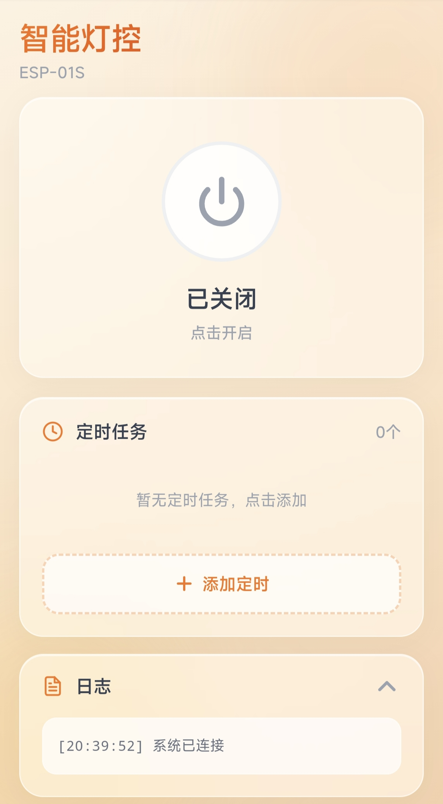
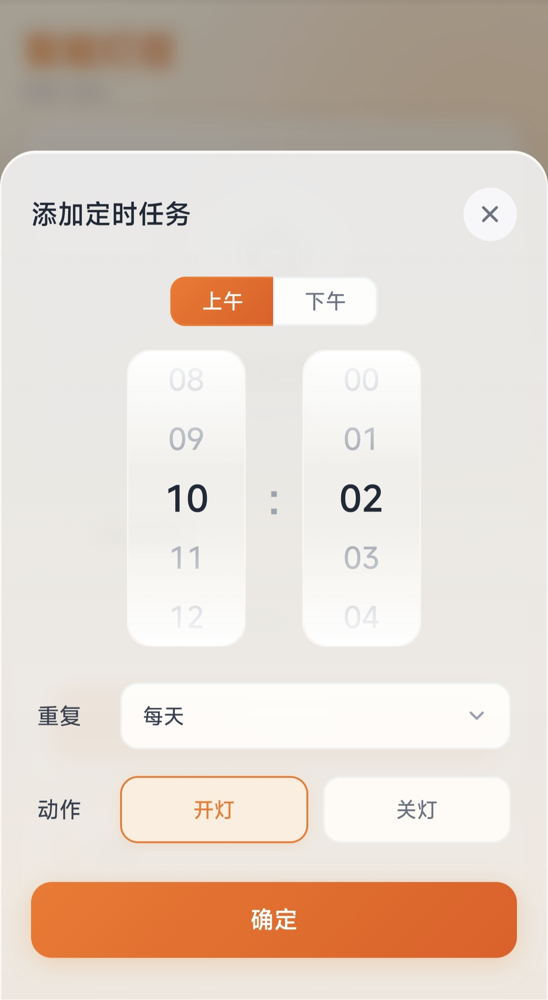

# 🏠 ESP-01S 智能灯控

基于 ESP-01S 的 WiFi 智能灯控系统，支持 Web 控制、定时开关、多重复周期设置，配有精美的移动端 UI。

---

## ✨ 功能特性

| 功能 | 说明 |
|------|------|
| 🔌 Web 远程控制 | 手机/电脑浏览器直接开关灯 |
| ⏰ 定时任务 | 最多 10 组定时，支持开灯/关灯 |
| 📅 重复周期 | 每天/工作日/周末/仅一次/自定义星期 |
| 🎡 时间选择器 | 滚轮式时间选择，支持 AM/PM |
| 🧊 毛玻璃 UI | 现代化移动端界面，自适应屏幕 |
| 📜 操作日志 | 实时记录开关灯和定时执行日志 |
| 🕐 NTP 自动校时 | 连接阿里云 NTP 服务器同步时间 |

---

## 🛠️ 开发环境搭建

### 1. 安装 Arduino CLI

#### macOS
```bash
brew install arduino-cli
```

#### Linux
```bash
curl -fsSL https://raw.githubusercontent.com/arduino/arduino-cli/master/install.sh | sh
sudo mv bin/arduino-cli /usr/local/bin/
```

#### Windows (PowerShell)
```powershell
Invoke-WebRequest -Uri "https://raw.githubusercontent.com/arduino/arduino-cli/master/install.ps1" -OutFile "$env:TEMP\install.ps1"
& "$env:TEMP\install.ps1"
```

### 2. 配置 Arduino CLI

```bash
# 初始化配置
arduino-cli config init

# 添加 ESP8266 开发板索引
arduino-cli config add board_manager.additional_urls   "https://arduino.esp8266.com/stable/package_esp8266com_index.json"

# 更新索引
arduino-cli core update-index

# 安装 ESP8266 核心（3.x 版本）
arduino-cli core install esp8266:esp8266@3.1.2

# 验证安装
arduino-cli core list
arduino-cli board listall | grep esp8266
```

## 📦 编译与烧录

### 1. 克隆 或 在github下载项目zip

```bash
git clone <your-repo-url>
cd esp01s-smart-light
```

### 2. 修改 WiFi 配置

编辑 `smart_light.ino`，修改以下常量：

```cpp
const char* ssid = "你的WiFi名称";
const char* password = "你的WiFi密码";
```

### 3. 编译项目

```bash
# 编译（指定 ESP-01S 开发板）
arduino-cli compile --fqbn esp8266:esp8266:generic . 
```
### 4. 烧录固件

#### 自动检测串口
```bash
arduino-cli upload --fqbn esp8266:esp8266:generic:eesz=1M64 -p $(arduino-cli board list | grep tty | awk '{print $1}') .
```

#### 手动指定串口
```bash
# Linux/macOS
arduino-cli upload --fqbn esp8266:esp8266:generic -p /dev/ttyUSB0 .

# macOS (CH340)
arduino-cli upload --fqbn esp8266:esp8266:generic -p /dev/tty.wchusbserial* .

# macOS (CP2102 芯片)
arduino-cli upload --fqbn esp8266:esp8266:generic -p /dev/tty.SLAB_USBtoUART .


# Windows
arduino-cli upload -p COMx --fqbn esp8266:esp8266:generic .
```

#### 烧录模式接线（GPIO0 接地）

烧录前将 GPIO0 与 GND 短接，然后上电或按 RST 复位：

```
GPIO0 ──┬── GND（烧录时短接）
        └── 悬空（运行时断开）
```

### 5. 监控串口输出

```bash
# Linux
arduino-cli monitor -p /dev/ttyUSB0 --config baudrate=115200

# macOS (CH340 芯片)
arduino-cli monitor -p /dev/tty.wchusbserial* --config baudrate=115200

# macOS (CP2102 芯片)
arduino-cli monitor -p /dev/tty.SLAB_USBtoUART --config baudrate=115200

# Windows
arduino-cli monitor -p COM3 --config baudrate=115200
```
## 🚀 使用说明

### 1. 首次启动

1. 烧录完成后，断开 GPIO0 与 GND 的连接
2. 重新上电或按 RST 复位
3. 打开串口监视器或路由器后台，查看分配的 IP 地址 
   ```
   Connected! IP: 192.168.x.x
   HTTP server started
   ```

### 2. 访问控制面板

手机或电脑连接同一 WiFi，浏览器访问：
```
http://192.168.x.x
```

### 3. 操作界面

- **电源按钮**：点击开关灯
- **定时任务**：添加/删除/启用/禁用定时
- **日志面板**：查看操作记录

### 4. 添加定时任务

1. 点击「添加定时」按钮
2. 使用滚轮选择时间（支持 AM/PM）
3. 选择重复周期（每天/工作日/周末/仅一次/自定义）
4. 选择动作（开灯/关灯）
5. 点击确定

---

## 📁 项目结构

```
.
├── smart_light.ino      # 主程序（含内嵌 HTML）
├── README.md            # 本文件
└── build/               # 编译输出目录
```

---

## ⚙️ 技术细节

### 定时任务数据结构

```cpp
struct TimerTask {
    uint8_t hour;      // 0-23
    uint8_t minute;    // 0-59
    uint8_t days;      // 位掩码: bit0=周日, bit1=周一...bit6=周六
    bool action;       // true=开灯, false=关灯
    bool enabled;      // 是否启用
    bool executed;     // 仅一次任务标记
};
```

### 星期位掩码

| 掩码值 | 含义 |
|--------|------|
| `0` | 仅一次 |
| `1` | 周一 |
| `2` | 周二 |
| `4` | 周三 |
| `8` | 周四 |
| `16` | 周五 |
| `32` | 周六 |
| `64` | 周日 |
| `62` | 工作日（周一~周五） |
| `65` | 周末（周六~周日） |
| `127` | 每天 |

### API 接口

| 端点 | 方法 | 说明 |
|------|------|------|
| `/` | GET | 返回控制页面 |
| `/toggle` | GET | 切换灯状态 |
| `/status` | GET | 返回灯状态（`1`=开，`0`=关） |
| `/timers` | GET | 获取定时任务列表（JSON） |
| `/timers` | POST | 保存定时任务列表（JSON） |

---

## 🐛 常见问题

### Q: 编译报错 "Board generic (platform esp8266) is unknown"
A: 确保已正确安装 ESP8266 核心：
```bash
arduino-cli core update-index
arduino-cli core install esp8266:esp8266
```

### Q: 烧录失败 "Failed to connect to ESP8266"
A: 检查 GPIO0 是否已接地，确保进入下载模式。部分下载器需要按 RST 键。

### Q: WiFi 连接失败
A: 检查 WiFi 名称和密码是否正确，确保 2.4GHz 频段。ESP-01S 不支持 5GHz。

### Q: 时间不同步
A: 确保设备能访问互联网（ntp.aliyun.com）。可在 `setup()` 中增加 NTP 同步等待时间。

### Q: 定时任务不执行
A: 检查 NTP 时间是否同步成功。定时任务在每分钟第 0 秒检查，需确保时间已校准。

---

## 📜 开源协议

MIT License

---

## 🙏 致谢

- [ESP8266 Arduino Core](https://github.com/esp8266/Arduino)
- 阿里云 NTP 服务器
